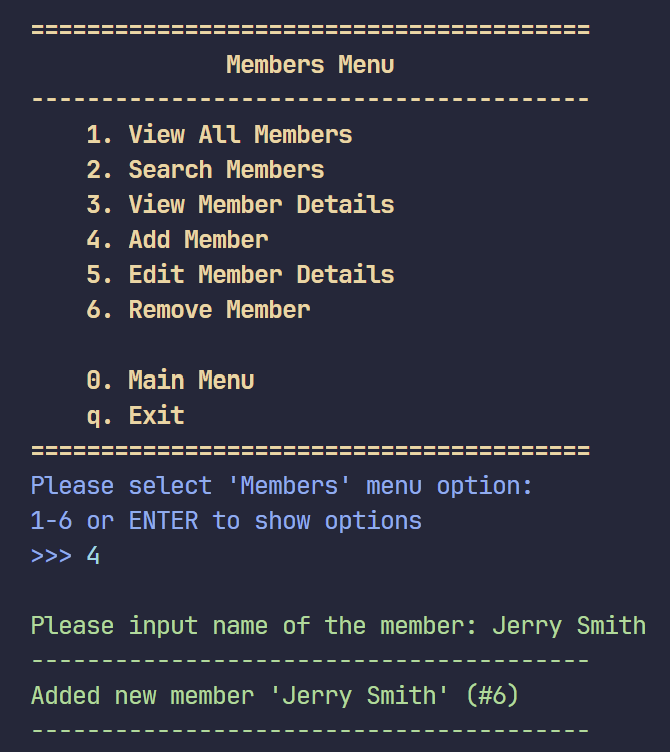
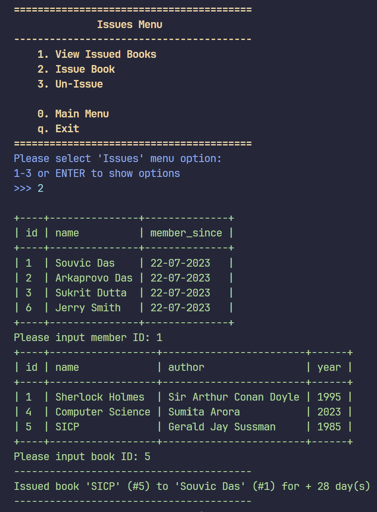

# Library Management System
CBSE Class 11 Library Management System Computer Science Project using MySQL
- For a simpler program. check out [`old-with-sql`](https://github.com/WitherredAway/library-management-system/tree/old-with-sql)
- For a simpler program using Dictionaries instead of MySQL, check out [`without-sql`](https://github.com/WitherredAway/library-management-system/tree/without-sql)

Feel free to use this program, but instead of just blindly copy-pasting it, please try to understand what is happening in the program before using it.

Also, feel free to open any issues if you have any questions. Not really accepting contributions though because this is a school project done in a very specific required way, but feel free to suggest any changes. I hope this helps :)

# Output
## Main Menu

## I. Members Menu

  
Click to expand

> ### 1. View All Members
> 

> ### 2. Search Members
> 

> ### 3. View Member Details
> 

> ### 4. Add Member
> 

> ### 5. Edit Member Details
> 

> ### 6. Remove Member
> 

## II. Books Menu

  
Click to expand

> ### 1. View Inventory
> 

> ### 2. Search Books
> 

> ### 3. View Book Details
> 

> ### 4. Add Book
> 

> ### 5. Edit Book Details
> 

> ### 6. Remove Book
> 

## III. Issues Menu

  
Click to expand

> ### 1. View Issued Books
> 

> ### 2. Issue Book
> 

> ### 3. Un-Issue
> 

The End!

